# Konfiguracja schematu Businesslink

**Dotyczy:** importu dokumentów z usługi Businesslink do Fakira
Idea jest taka:
1. Badamy ustawioną klasyfikację i na jej podstawie ustalamy numer konta
2. Klasyfikacja może być ustawiona tylko w nagłówku, wtedy wszystkie pozycje mają to samo konto
3. Klasyfikacja może być ustawiona dla pozycji. Wtedy na tych pozycjach, na których
jest ustawiona dekret zrobi się na jej podstawie. Na pozycjach bez wybranej
klasyfikacji ustawi się dekret na podstawie klasyfikacji z nagłówka.
Do ustalenia czy klasyfikacja jest na którejkolwiek pozycji służy zmienna [@jest_klasyfikacja_poz]

Kwota netto występuje w dwóch warunkach w zalezności, czy księgujemy tylko z nagłówka czy z pozycji


## Klasyfikacja - ustawiana w menu Dokumenty -> Import z KSeF i Businesslink

Przykład klasyfikacji oparty na tym, że kod jest bezpośrednio istniejącym kontem.
Znacznie ułatwia to późniejsze tworzenie schematu. Opis wspomaga obsługę.

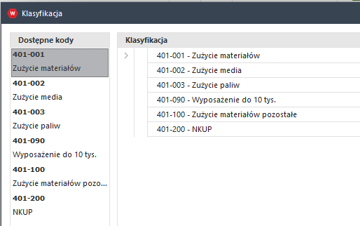

## Schemat - menu Import definicje -> Import - schematy księgujące -> Nazwa źródła 'Businesslink'

### Najpierw wykonaj aktualizację metabazy żeby przesłać wpisane w Klasyfikacji dane do schematu

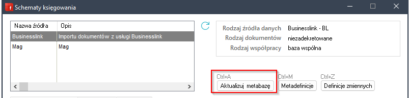

Tę operację należy powtarzać każdorazowo kiedy dodajemy coś do klasyfikacji

Usunięcie z metabazy skasowanych z klasyfikacji danych można zrobić po wejściu w metadefinicje

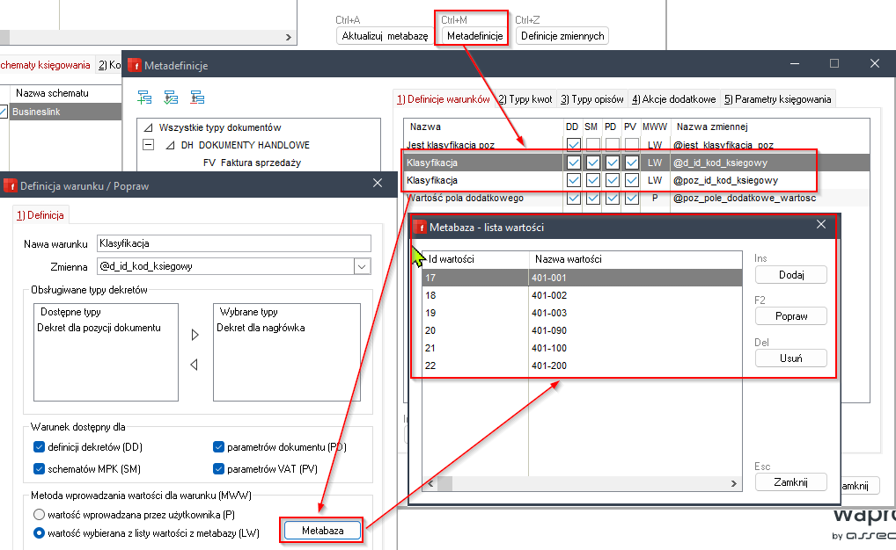

## Teraz definiujemy zmienne

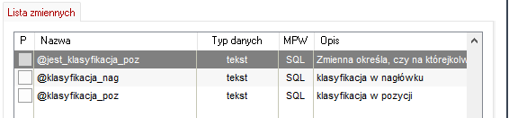

### [@jest_klasyfikacja_poz]

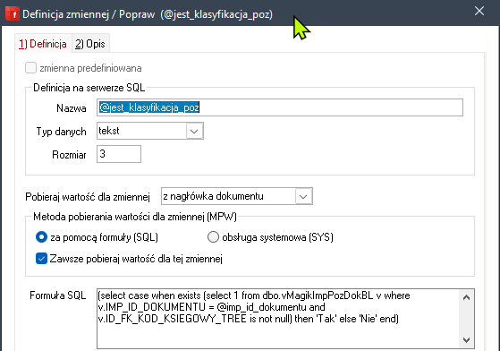

(to do dodania)

```sql
(select case when exists (select 1 from dbo.vMagikImpPozDokBL v where v.IMP_ID_DOKUMENTU = @imp_id_dokumentu and v.ID_FK_KOD_KSIEGOWY_TREE is not null) then 'Tak' else 'Nie' end)
```

### [@klasyfikacja_nag]

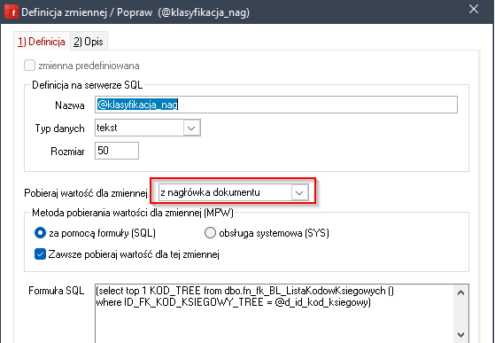

```sql
(select top 1 KOD_TREE from dbo.fn_fk_BL_ListaKodowKsiegowych ()
where ID_FK_KOD_KSIEGOWY_TREE = @d_id_kod_ksiegowy)
```

### [@klasyfikacja_poz]

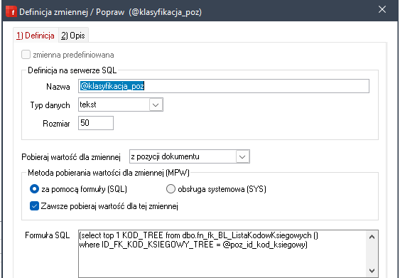

(ten kod ewentualnie do poprawy)

```sql
(select top 1 KOD_TREE from dbo.fn_fk_BL_ListaKodowKsiegowych ()
where ID_FK_KOD_KSIEGOWY_TREE = @poz_id_kod_ksiegowy)
```

## Definicja warunków

Dodajemy zmienną 'jest klasyfikacjapoz' na FZ i KFZ

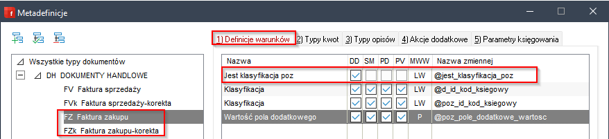

Można ją oprzeć o warunki z metabazy (wpisane ręcznie)

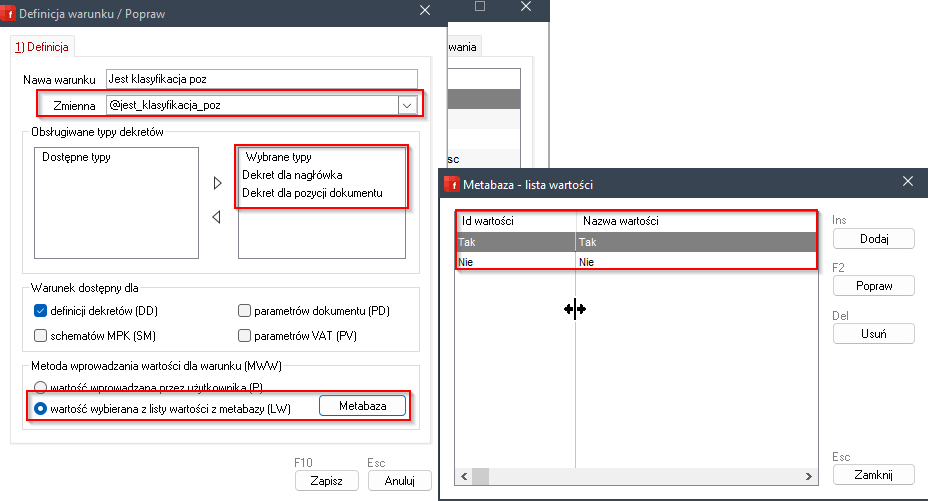

## Przechodzimy do schematu

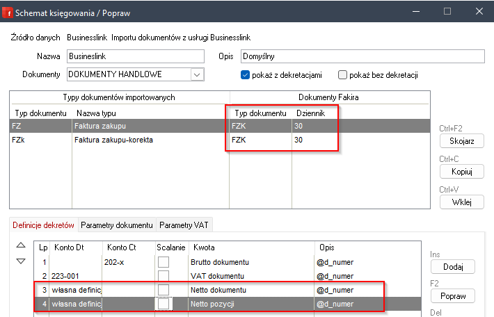

Kwoty i brutto i VAT tradycyjnie, kwota netto przy księgowaniu z nagłówka

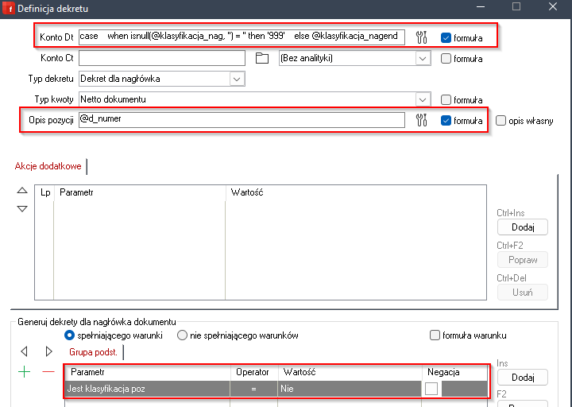

Używamy tu w warunku zmiennej 'jest klasyfikacja poz' zdefiniowanej krok wcześniej.
I kodu dla konta DT

```sql
case
    when isnull(@klasyfikacja_nag, '') = '' then '999'
    else @klasyfikacja_nag
end
```

I księgowanie z pozycji (tu ewentualnie algorytm do dodania\poprawy)

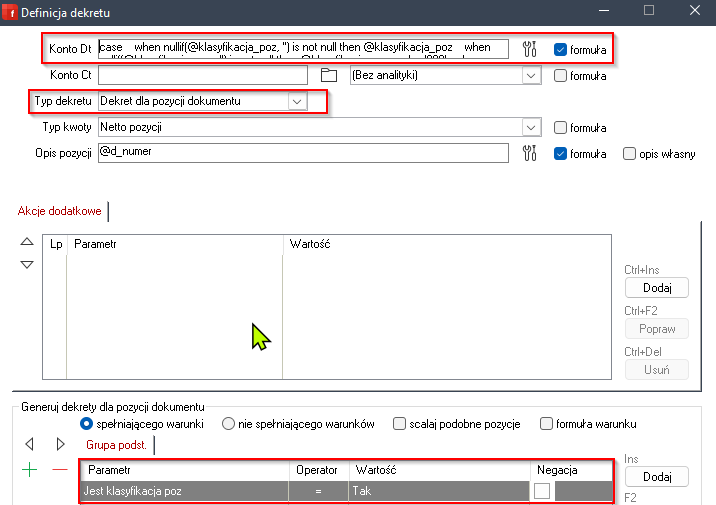


```sql
case
    when nullif(@klasyfikacja_poz, '') is not null then @klasyfikacja_poz
    when nullif(@klasyfikacja_nag, '') is not null then @klasyfikacja_nag
    else '999'
end
```

# Przykłady

### W nagłowku jedna klasyfikacja, w dwóch pozycjach dwie kolejne, jednej brak

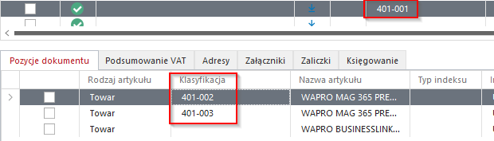

Dwa konta wzięte z pozycji, trzecie z nagłówka

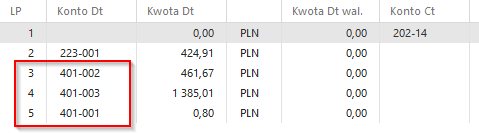